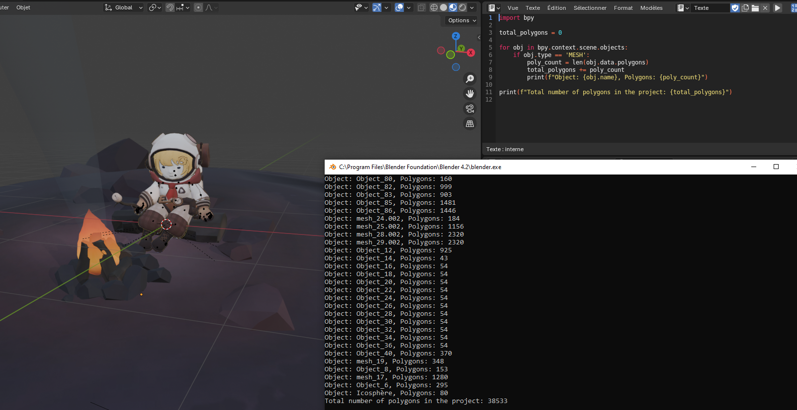

# Simple Mesh Counter For Blender

This script is designed to help you quickly calculate the total number of polygons in your Blender project. Whether you're optimizing your models or just curious about the complexity of your scene, this script provides a simple way to get the information you need.

## Features

- **Counts polygons**: Automatically counts the total number of polygons for each mesh object in your Blender scene.
- **Detailed output**: Displays the polygon count for each object individually, as well as the total number of polygons across the entire scene.

## Installation

1. Clone this repository or download the script directly.
2. Open Blender and go to the scripting workspace.
3. Load the script into the text editor and run it.

## Usage

1. Open your Blender project.
2. Run the script in the scripting workspace.
3. Check the console for the output, which will list the number of polygons for each object and the total number.

Here is an example of what you might see in the console:

Object: Cube, Polygons: 6 Object: Sphere, Polygons: 32 Total number of polygons in the project: 38

## Illustration

Below is an illustration showing a visual representation of the polygon counting process in Blender:

## Contributing

If you have suggestions for improvements or encounter any issues, feel free to open an issue or submit a pull request.

## License

This project is licensed under the MIT License. See the [LICENSE](LICENSE) file for details.

# Simple_Mesh_Counter_For_Blender
